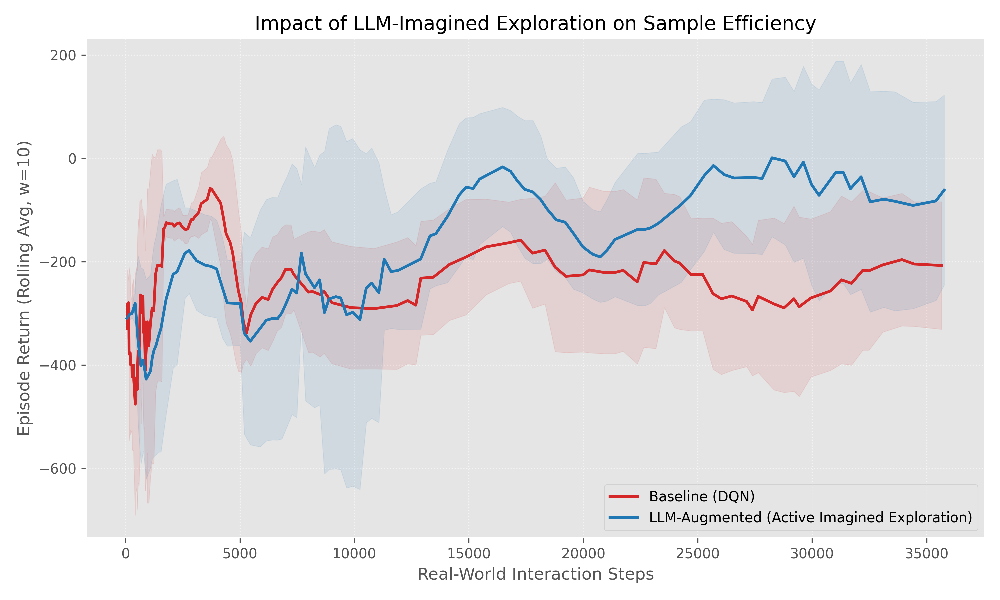

# LLAMBO-RL: LLM-Augmented Bayesian Transition Optimization for Efficient Reinforcement Learning

> Treating a Large Language Model as a Bayesian optimizer over an environment's transition distribution — using it to *dream* high-return synthetic experience that warm-starts a Deep Q-Network on `LunarLander-v3`.

**Author:** Nicholas Bossi
**Environment:** Gymnasium `LunarLander-v3`
**Companion paper:** [`Writeup/main.tex`](../Writeup/main.tex) — *LLM-Augmented Bayesian Transition Optimization for Efficient Reinforcement Learning in the Lunar Lander Task*

---

## Motivation

Model-free reinforcement learning is notoriously **sample-inefficient**: standard exploration can require hundreds of thousands of environment interactions to discover high-reward regions of the state–action space, particularly under sparse or non-linear reward signals. In `LunarLander-v3`, a vanilla DQN typically only converges around **~200,000 steps** — so the entire useful regime for sample-efficiency research lives in the *early-training* phase.

Bayesian Optimization (BO) addresses expensive black-box objectives by maintaining a **surrogate model** and an **acquisition function** to guide search. Classical surrogates (e.g. Gaussian Processes) struggle with the high-dimensional, non-Euclidean structure of RL trajectories. Recent work shows that LLMs can act as implicit Bayesian reasoners and zero-shot warm-starters for optimization.

**LLAMBO-RL** extends this surrogate–sampler duality from hyperparameter space into **transition space**. We use a pre-trained LLM as a generalized world model: it both *proposes* candidate transitions and *scores* their reward, supplying a dense, physics-aware learning signal that pure exploration would take far longer to find.

---

## Method

We model the agent–environment interaction as an MDP $(\mathcal{S}, \mathcal{A}, \mathcal{P}, \mathcal{R}, \gamma)$ and maintain a buffer of real transitions $\mathcal{D}_{\text{real}}$. The LLM serves a **dual role**, mirroring the acquisition/evaluation loop of Bayesian Optimization:

1. **Candidate sampler** — given few-shot examples from $\mathcal{D}_{\text{real}}$, the LLM proposes $M$ new state–action–next-state transitions $\tau_m = (s, a, s_{\text{next}})_m$ conditioned to yield high return.
2. **Reward surrogate** — the LLM then estimates the reward of each proposed transition:

$$\hat{r}(s, a, s_{\text{next}}) = f_{\text{LLM}}(\tau \mid \mathcal{D}_{\text{real}})$$

A **top-$K$ acquisition filter** keeps only the transitions with the highest surrogate rewards, forming a *dreams* buffer $\mathcal{D}_{\text{dreams}}$. The agent is then trained offline on the augmented dataset:

$$\mathcal{D}_{\text{train}} = \mathcal{D}_{\text{real}} \cup \mathcal{D}_{\text{dreams}}$$

The top-$K$ selection acts as a robustness mechanism: even when the LLM hallucinates physically inconsistent transitions, the joint reward evaluation filters them out before they enter the buffer.

### Training loop

The procedure alternates between online interaction and offline simulation-augmented optimization:

| Step | Phase | Description |
|------|-------|-------------|
| 0 | **Warm start** | 1,000 steps of random exploration populate $\mathcal{D}_{\text{real}}$. |
| 1 | **Interact** | The DQN agent collects a chunk of real transitions in the environment. |
| 2 | **Dream (sample)** | The LLM is prompted with recent real transitions and proposes $M = 100$ new high-return candidates. |
| 3 | **Critique (evaluate)** | The LLM estimates a reward for each proposed transition. |
| 4 | **Select** | The top $K = 50$ transitions by predicted reward are appended to $\mathcal{D}_{\text{dreams}}$. |
| 5 | **Consolidate** | The agent performs gradient steps on $\mathcal{D}_{\text{train}}$ before returning to step 1. |

We use **DQN** for its efficiency in discrete action spaces and robustness under off-policy learning. The LLM is `grok-4-fast-non-reasoning`, queried via the xAI SDK; its non-reasoning, low-latency profile is what makes the repeated dreaming loop tractable.

---

## Repository layout

```
code2/
├── agent.ipynb              # Main notebook: full LLAMBO-RL training & evaluation loop
├── datasets/
│   ├── historical_data_llm.csv       # Real transitions collected by the LLM-augmented agent
│   ├── historical_data_baseline.csv  # Real transitions collected by the baseline DQN
│   ├── imagined_data.csv             # Elite LLM-dreamed transitions (s, a, r, s', done)
│   ├── results_llm.csv               # (steps, return) learning curve — LLAMBO-RL
│   └── results_baseline.csv          # (steps, return) learning curve — baseline DQN
├── models/                  # Checkpointed DQN policies (1k–~70k step snapshots, .zip)
├── learning_curve.png       # Comparison plot (see Results)
├── pyproject.toml           # Project metadata & dependencies
└── uv.lock                  # Locked dependency versions
```

**Transition CSV schema** (`historical_data_*.csv`, `imagined_data.csv`): `obs`, `action`, `reward`, `next_obs`, `done` — where `obs`/`next_obs` are 8-dimensional state vectors stored as bracketed lists.

**State space** (8-D): `(x, y, vel_x, vel_y, angle, ang_vel, leg1_contact, leg2_contact)`.
**Action space** (discrete, 4): `0` do nothing · `1` fire left engine · `2` fire main engine · `3` fire right engine.

---

## Setup

This project uses [`uv`](https://github.com/astral-sh/uv) for dependency management and pins Python 3.11.

```bash
# from the code2/ directory
uv sync                    # creates .venv and installs locked dependencies
```

Key dependencies (see `pyproject.toml`):

- `stable-baselines3` — DQN implementation and replay buffer
- `gymnasium[box2d]` + `swig` — the LunarLander-v3 environment
- `openai` — client used to query the Grok LLM via xAI's OpenAI-compatible endpoint
- `pandas` / `numpy` / `matplotlib` — data handling and plotting
- `jupyter` — to run `agent.ipynb`

### API key

The dreaming loop requires an xAI API key. Set it in your environment before launching the notebook:

```bash
export XAI_API_KEY="your-key-here"
```

> ⚠️ Do **not** hard-code API keys into the notebook or source files before committing.

---

## Running

```bash
uv run jupyter lab agent.ipynb
```

`agent.ipynb` walks through the full pipeline: environment setup, DQN initialisation, the interact → dream → critique → select → consolidate loop, and the head-to-head evaluation against a baseline DQN. Learning curves are logged to `datasets/results_*.csv` and rendered to `learning_curve.png`; intermediate policies are checkpointed under `models/`.

---

## Results



Preliminary experiments indicate that agents trained with $\mathcal{D}_{\text{dreams}}$ achieve **higher returns in fewer environment steps** than a baseline DQN trained only on $\mathcal{D}_{\text{real}}$. Solid lines show mean episode return over a 10-episode window; shaded regions are $\pm 1$ standard deviation. The LLM-augmented agent (blue) outperforms the baseline (red) throughout the early-training regime.

Because LunarLander-v3 DQN only converges around ~200,000 iterations, the entire plot lies in the early-training phase — precisely where a good prior matters most. The LLM appears to apply a *generalized* understanding of physical constraints (gravity, thrust, angular momentum) rather than merely interpolating historical data, giving the agent dense demonstrations of stable descent from the outset.

---

## Discussion

- **LLMs as physics priors.** Instead of relying on random exploration to stumble upon reward, the agent receives synthetic demonstrations that emphasise orientation stability and fuel conservation — a dense, informative prior.
- **Surrogate–sampler duality.** The single LLM plays both BO roles. Top-$K$ selection turns its reward predictions into a robust acquisition filter against hallucination.
- **Implicit Bayesian reasoning.** Conditioning on $\mathcal{D}_{\text{real}}$ supplies a likelihood of current dynamics; the LLM combines this with its pre-trained prior to emit posterior-like samples of high-reward transitions — bypassing the fragile density estimation of GP surrogates.
- **Bridging MBRL and model-free RL.** No transition network is trained from scratch; the world model is *outsourced* to a pre-trained LLM, trading training compute for inference latency.

---

## Limitations & future work

This study was constrained by implementation time and by the choice of an API-served LLM, which can hallucinate environment-specific physics and which forced the use of an **offline** DQN (API latency precludes real-time online updates). Promising directions:

- **Full-trajectory simulation** — simulating whole rollouts to estimate *returns* (the true RL objective) rather than single-step rewards.
- **Uncertainty-aware acquisition** — selecting transitions by the variance of the LLM's reward predictions.
- **Prompt engineering** — systematic study of input ordering, which materially affects output stability.
- **Dynamic $K$** — adapting the number of dreamed transitions to the agent's epistemic uncertainty.
- **Online learning with a local LLM** — hosting the model locally to remove latency, enabling on-policy methods (e.g. PPO) trained *inside* an LLM-simulated world model, with the LLM iteratively reacting to the agent's actions.

---

## Citation

If you build on this work, please cite the companion paper:

```bibtex
@misc{bossi2026llamborl,
  title  = {LLM-Augmented Bayesian Transition Optimization for Efficient
            Reinforcement Learning in the Lunar Lander Task},
  author = {Bossi, Nicholas},
  year   = {2026}
}
```

### Selected references

- Liu et al. *LLAMBO: Large Language Models to Enhance Bayesian Optimization* (2024)
- Xie et al. *An Explanation of In-context Learning as Implicit Bayesian Inference* (2021)
- Ha & Schmidhuber. *World Models* (2018)
- Ma et al. *Eureka: Human-Level Reward Design via Coding LLMs* (2023)
- Yan et al. *Efficient RL with LLM Priors* (2024)
